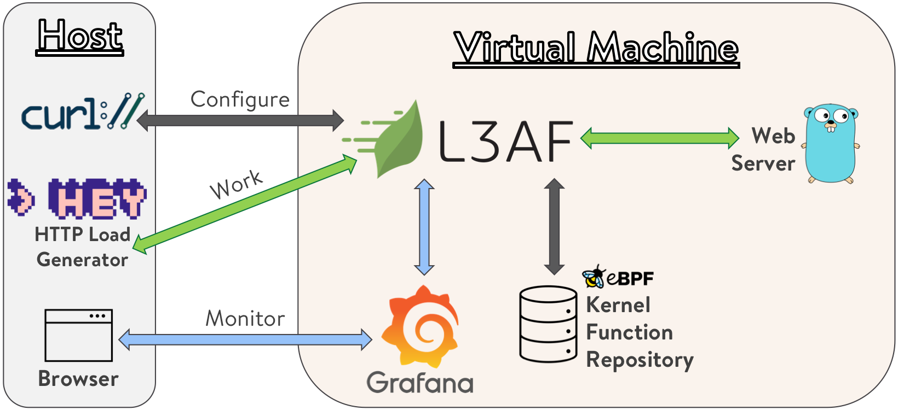

# L3AF Development Environment

The L3AF dev environment is a [Vagrant](https://www.vagrantup.com/) virtual
machine environment that allows users to develop, test, or just try out L3AF.

The Vagrant virtual machine environment only works for non Apple M1/M2 CPU based MAC computers.  A separate [shell script](https://github.com/l3af-project/l3af-arch/blob/main/dev_environment/Setup_Dev_Env.md) can set up the Linux virtual machine L3AF development environment for MAC/PC with Arm or x86 CPUs, Windows WSL and cloud based Linux VM (i.e. Azure Linux VM). 

# Overview

The L3AF dev environment automation sets up a virtual machine that contains:

* Dependencies required to build L3AFD and eBPF programs
* Simple web servers (written in Go) to which test traffic can be sent
* Prometheus and Grafana for metrics
* A local eBPF Package Repository (simple Python file server)

The host machine can access various services on the virtual machine via
user-configured ports.

Here is a visual overview:

# Host Prerequisites

* [Vagrant](https://www.vagrantup.com/)
* [VirtualBox](https://www.virtualbox.org/)
* [L3AFD source code](https://github.com/l3af-project/l3afd)
* [curl](https://curl.se/)
* [hey](https://github.com/rakyll/hey) or any HTTP load generator
* A web browser

# Trying out L3AF

* Edit [config.yaml](config.yaml) to point to the
  [source code](https://github.com/l3af-project/l3afd) on your host machine.
  This code will be mounted by the virtual machine. Additionally, you may modify
  the default ports used on the host to access services on the virtual machine.
  (Note, however, that this document will refer to the default ports.)
* If you don't already have the vagant reload plugin, you'll need to install it,
  `vagrant plugin install vagrant-reload`.
* Run `vagrant up`. This should take just a few minutes to bring up the
  virtual machine from scratch.
* Verify that the host can send traffic to a web server running on the VM:
  `hey -n 200 -c 20 http://localhost:18080`. This command should return quickly
  and result in successful HTTP responses (200 OK).
* Run `vagrant ssh`, this will log you into the virtual machine
* On the VM, go to `~/code/l3afd` and run `make install`
* On the VM, go to `~/go/bin` and run `l3afd` as root:
  `sudo ./l3afd --config /vagrant/cfg/l3afd.cfg`
* On the host, configure L3AFD to execute sample eBPF programs by running
  `curl -X POST http://localhost:37080/l3af/configs/v1/update -d
  "@cfg/payload.json"`. The [payload.json](cfg/payload.json) file can be
  inspected and modified as desired. For more information on the L3AFD API see
  the [L3AFD API documentation](https://github.com/l3af-project/l3afd/tree/main/docs/api).
* The Swagger UI on the host machine `http://localhost:37080/swagger/index.html`
  can also be used to add or remove which eBPF programs are running inside the
  virtual machine.
* Verify the eBPF programs from [payload.json](cfg/payload.json) are running by
  querying the L3AFD debug API from the host:
  `curl http://localhost:38899/kfs/enp0s3`. This command assumes `enp0s3` is a
  valid network interface on the VM.
* Once again send traffic to the VM web server:
  `hey -n 200 -c 20 http://localhost:18080`. The traffic will now be running
  through the eBPF programs (which may affect results dramatically depending
  on which eBPF programs are running and how they are configured).
* To see the eBPF program metrics, browse to `http://localhost:33000` on the
  host and login to Grafana with the default username and password of `admin`.
  After logging in you will be able to view the preconfigured dashboards.
